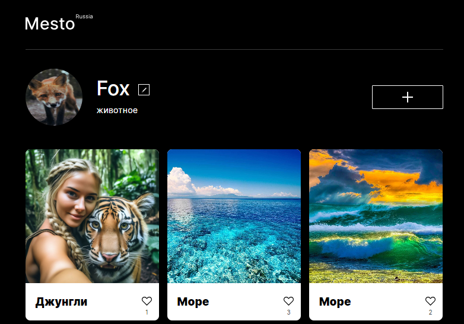
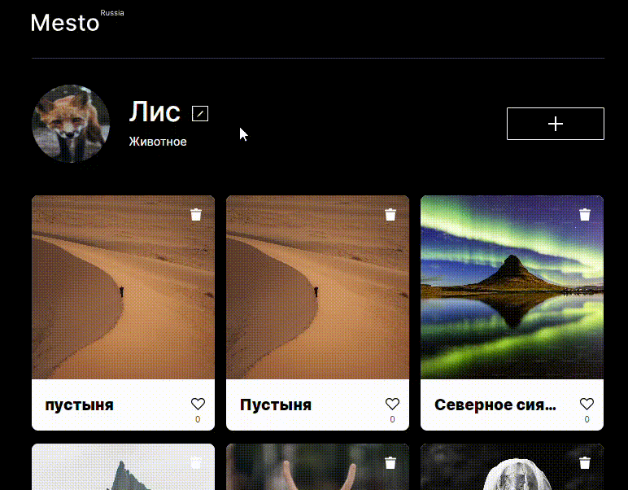
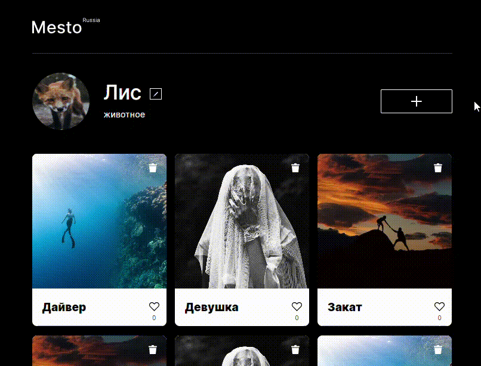
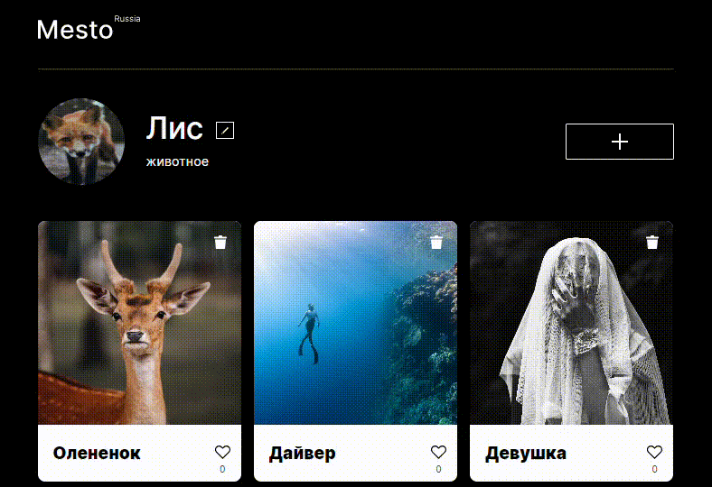
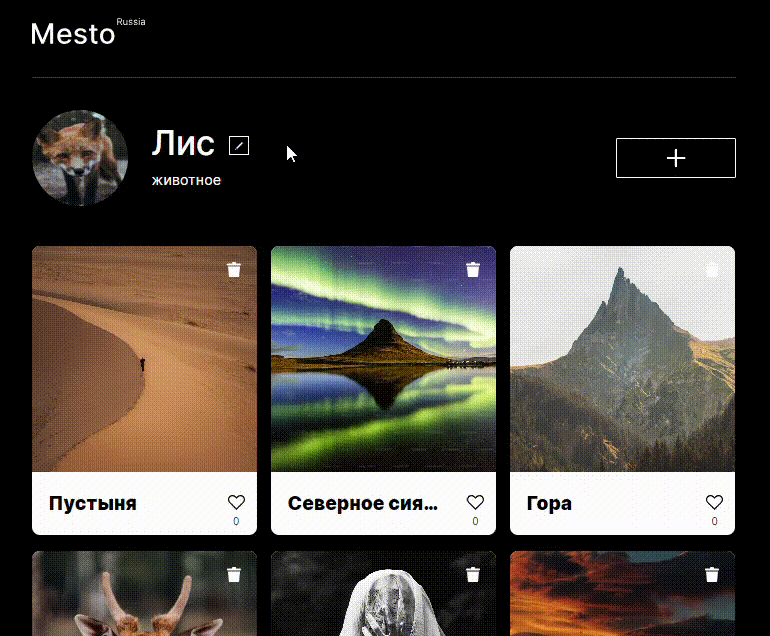
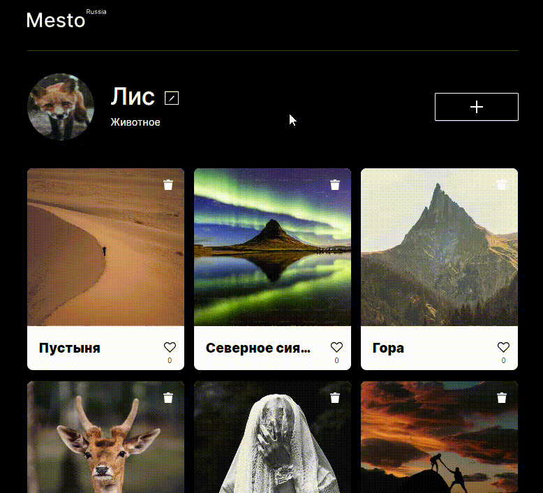
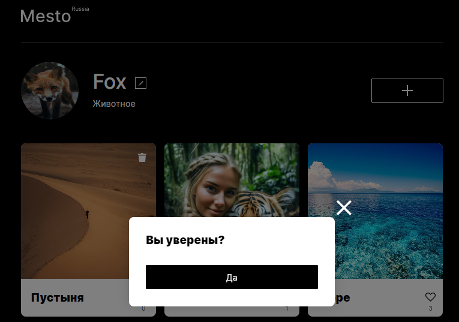
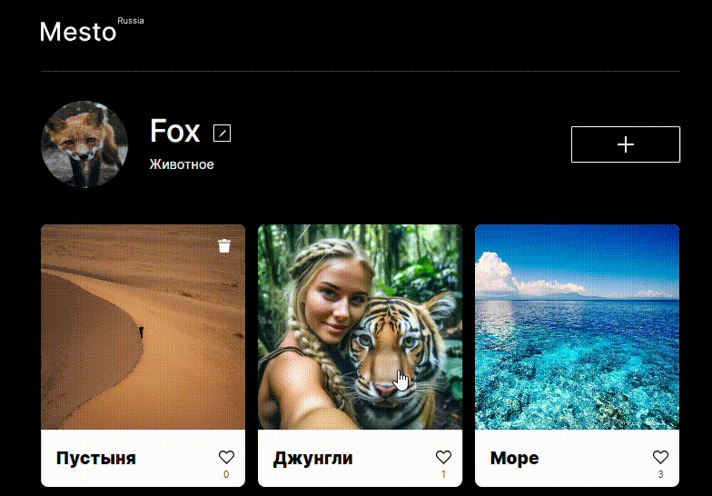

<h1 align="center">"Место"</h1>
<h3 align="center">Третья проектная работа</h3>

## Описание проекта

Учебный проект от [Я.Практикум](https://practicum.yandex.ru/web/) предтставляет собой интерактивную страницу, куда можно добавлять фотографии, удалять их и ставить лайки.

Данный проект был разделен на 6 основных частей:

1. Вёрстка сайта и написание части логики на JavaScript

2. Доработка функционала на JavaScript

3. Разработка валидации всех форм, а также улучшение UX при работе с popup

4. Рефакторинг кода

5. Рефакторинг кода и сборка проекта Вебпаком

6. Подключение проекта к серверу

<h3 align="center">1. Вёрстка сайта и написание части логики на JavaScript</h3>

К вёрстке основными требованиями были:
- Вёрстка по [макету](https://www.figma.com/file/2cn9N9jSkmxD84oJik7xL7/JavaScript.-Sprint-4?type=design&node-id=0-1&mode=design&t=Rpvinq2OjHnumSG0-0);
- Адаптивность;
- Файловая структура организована по БЭМу;
- При переполнение содержимого в блоке должно появляться многоточие;
  

<b>Демонстрация</b>

  

  

К логике на JavaScript основными требованиями были:
- Открытие popup при нажатии на кнопку ✎ и его закрытие при нажатии на кнопку ☒;
- При открытии popup поля формы должны быть заполнены значениями, которые отображены на странице;
- При редактировании формы и нажатии кнопки "Сохранить", popup должен автоматически закрыться, а значения на странице измениться на сохраненые;
  

<b>Демонстрация</b>

  

  

<h3 align="center">2. Доработка функционала на JavaScript</h3>

К доработке функционала относится:
- Вёрстка по [макету](https://www.figma.com/file/bjyvbKKJN2naO0ucURl2Z0/JavaScript.-Sprint-5?type=design&node-id=0-1&mode=design&t=zLPzA7nNYKKA9tGK-0);
- Плавное открытие и закрытие popup;
- Открытие popup при нажатии на кнопку ✚ и его закрытие при нажатии на кнопку ☒;
- Можно написать название карточки и дать ссылку на картинку;
- При нажатии на кнопку "Создать", popup должен автоматически закрыться, а новая карточка становится первой на странице;
  

<b>Демонстрация</b>

  

  

- Реализовать функционал удаление карточки при клике на кнопку 🗑;
- Реализовать функционал постановки лайка карточки (при нажатии на кнопку 🤍, лайк закрашивается чёрным 🖤);
  

<b>Демонстрация</b>

  

  

- Открытие popup с картинкой для режима просмотра;
  

<b>Демонстрация</b>

  

  

<h3 align="center">3. Разработка валидации всех форм, а также улучшение UX при работе с popup</h3>

К разработке валидации форм относятся следующие пункты:
- Вёрстка элементов ошибок по [макету](https://www.figma.com/file/kRVLKwYG3d1HGLvh7JFWRT/JavaScript.-Sprint-6?type=design&node-id=0-1&mode=design&t=MM8BkcPe4woBpLlW-0);
- Текст ошибок стандартные браузерные;
- Валидация формы «Редактировать профиль»:
  * оба поля обязательные;
  * в поле «Имя» должно быть от 2 до 40 символов;
  * в поле «О себе» должно быть от 2 до 200 символов;
- Кнопка "Сохранить" активна только при прохождении валидации всех полей;
  

<b>Демонстрация</b>

  

  

- Валидация формы «Новое место»:
  * оба поля обязательные;
  * в поле «Название» должно быть от 2 до 30 символов;
  * в поле «Ссылка на картинку» должен быть URL;
- Кнопка "Создать" активна только при прохождении валидации всех полей;
  

<b>Демонстрация</b>

  

  

- Закрытие popup кликом на оверлей;
- Закрытие popup нажатием на 'Esc';
  

<b>Демонстрация</b>

  

  

  <h3 align="center">4. Рефакторинг кода</h3>

Необходимо было провести рефакторинг кода, а именно:
- Создать классы Card и FormValidator;

  <h3 align="center">5. Продолжение рефакторинга кода и сборка проекта Вебпаком</h3>
  
Итоговая структура проекта

  

  

К продолжению рефакторинга относится:
- Создание классов Section, Popup, PopupWithImage, PopupWithForm, UserInfo;
- Создание файла .gitignore;
- Настройка сборки проекта Webpack-ом, а именно:
  * Инициализация пакета;
  * Установка webpack, webpack-cli и webpack-dev-server;
  * Настройка минификации и транспиляции JS бабелем;
  * Настройка обработки CSS Webpack-ом;
  * Настройка минификации CSS и автоматического добавления вендорных префиксов;
  * Настройка обработки изображений и шрифтов;
  * Настройка обработки HTML;

  <h3 align="center">6. Подключение проекта к серверу</h3>

К выполнению данной части проектной работы необходимо было:
- Сформировать запросы API к серверу: https://mesto.nomoreparties.co;
- Запросы GET, PATCH, POST, PUT, DELETE;
- Вёрстка popup подтверждения удаления карточки, обновления автара и отображение количество поставленных лайков по [макету](https://www.figma.com/file/PSdQFRHoxXJFs2FH8IXViF/JavaScript.-Sprint-9?type=design&node-id=0-1&mode=design&t=nVsn7FHArrx3pzTw-0);
- Добавление функционала подтверждения удаления карточки;
- Реализация возможности удаления карточек только созданных вами;
  

<b>Демонстрация</b>

  

  

- Постановка и снятие лайка;
  

<b>Демонстрация</b>

  

  

- Обновление аватара пользователя: 
  * При наведении на иконку аватара появляется иконка редактирования;
  * При клике на иконку редактирования, открывается popup "Обновление аватара";
  * Валидация формы на URL;
  * При нажатии на кнопку "Сохранить" popup автоматически закрывается, а значения на странице меняется на сохраненное;
  

<b>Демонстрация</b>

  

  

- Уведомление пользователя о процессе загрузки, поменяв текст кнопки на: «Сохранение...», пока данные загружаются;

## Используемые технологии

* HTML5 | 
* БЭМ / файловая структура в соответствии с Nested БЭМ | 
* CSS3:
  * Flexbox;
  * Grid Layout;
  * Positioning;
  * Adaptive UI;
  * Media Queries
* JavaScript:
  * Объектно-ориентированное программирование;
  * Асинхронность и оптимизация;
  * API (Application Programming Interface);
  * Стиль CamelCase;
* Webpack |

## Установка и запуск проекта:

Клонировать репозиторий:

    git clone git@github.com:elislis7/mesto.git

Установить зависимости:

    npm install

Собрать проект:

    npm run build

Запустить проект:

    npm run dev

## Ссылки на макеты Figma
1. [Макет 1](https://www.figma.com/file/2cn9N9jSkmxD84oJik7xL7/JavaScript.-Sprint-4?type=design&node-id=0-1&mode=design&t=Rpvinq2OjHnumSG0-0)
2. [Макет 2](https://www.figma.com/file/bjyvbKKJN2naO0ucURl2Z0/JavaScript.-Sprint-5?type=design&node-id=0-1&mode=design&t=zLPzA7nNYKKA9tGK-0)
3. [Макет 3](https://www.figma.com/file/kRVLKwYG3d1HGLvh7JFWRT/JavaScript.-Sprint-6?type=design&node-id=0-1&mode=design&t=MM8BkcPe4woBpLlW-0)
4. [Макет 4](https://www.figma.com/file/PSdQFRHoxXJFs2FH8IXViF/JavaScript.-Sprint-9?type=design&node-id=0-1&mode=design&t=nVsn7FHArrx3pzTw-0)

## [Ссылка на сайт](https://elislis7.github.io/mesto/)

<h4 align="center">План по доработке проекта</h4>

-[x]
